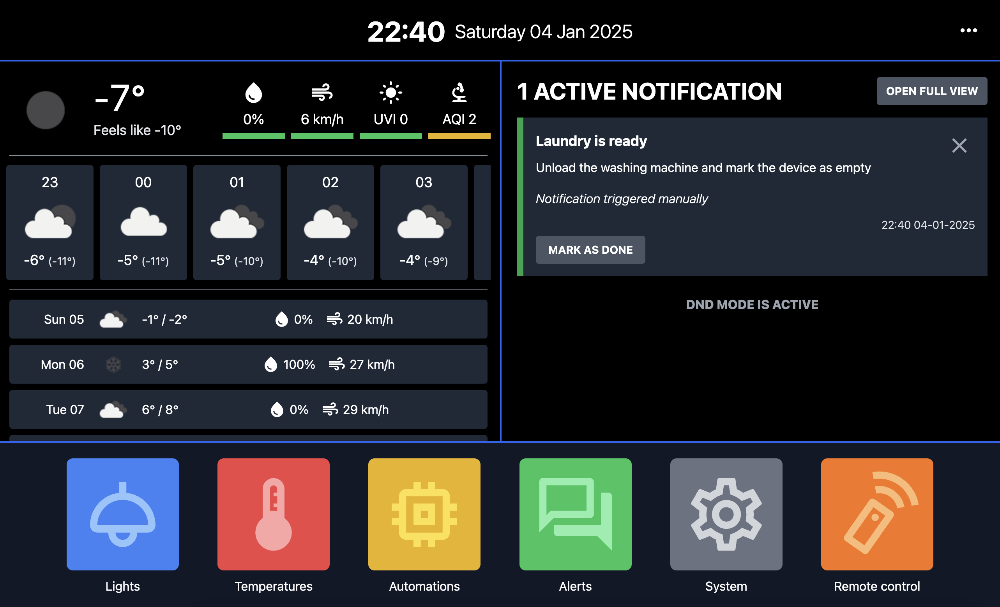
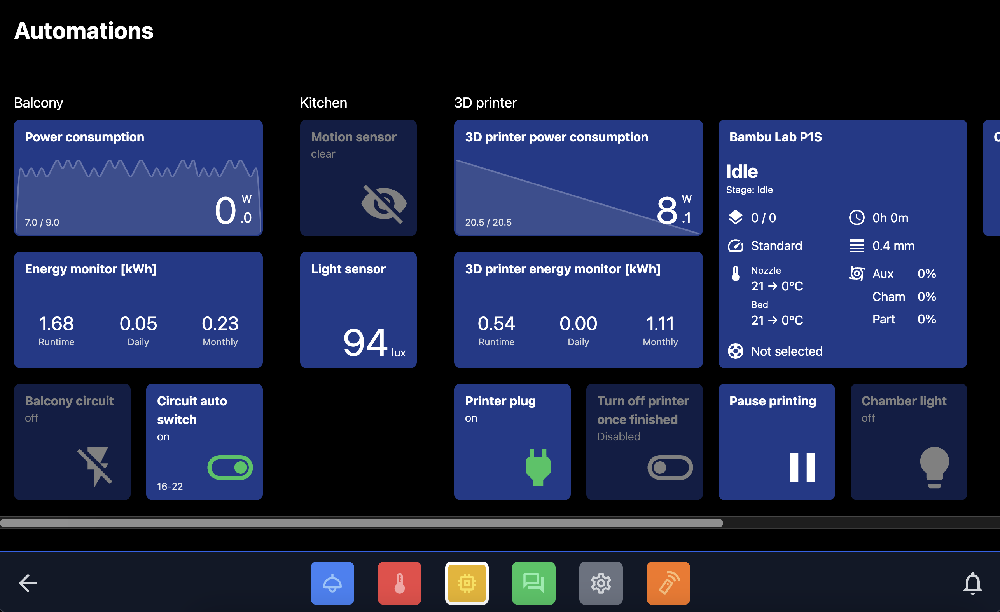
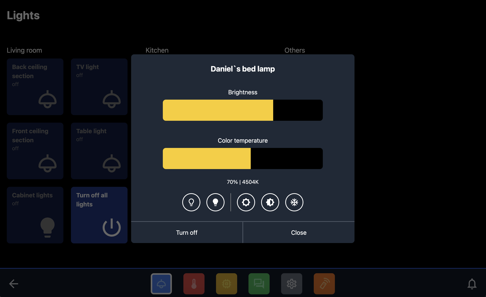
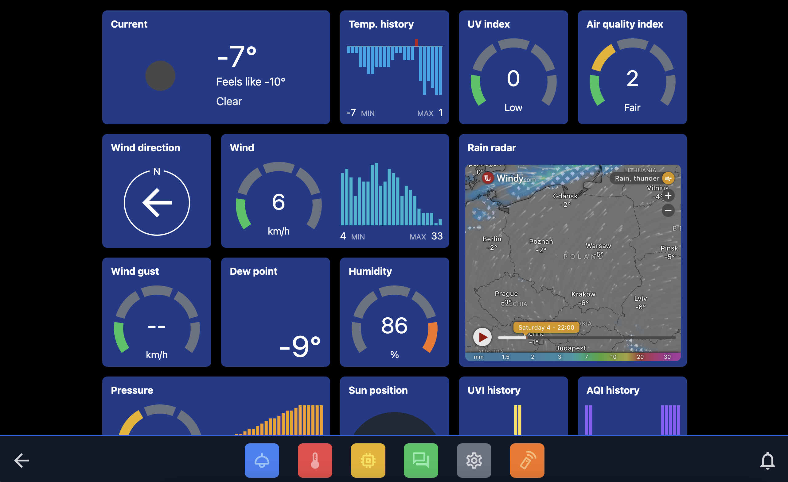
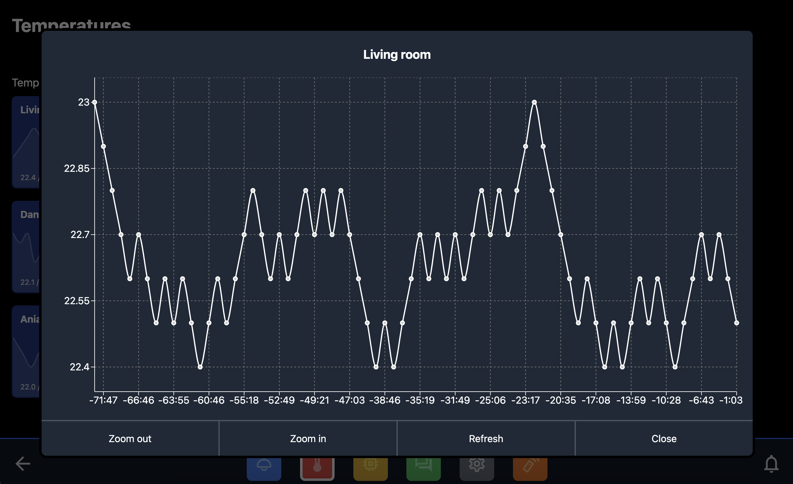

# Home Assistant Dashboard

This project is a custom dashboard website for my Home Assistant smart home system. It is designed to work on wall-mounted tablet and [Fully Kiosk Browser app](https://play.google.com/store/apps/details?id=de.ozerov.fully).

**Why I am not using the standard Lovelace UI?**
I am not a big fan of Material Design and I wanted to create something more specialized. I also wanted to have more control over the layout and the way the tiles are displayed. I also wanted to have a possibility to create custom tiles for my specific smart home devices.

**Can I use this for my own HomeAssistant instance?**
Sure! Feel free to fork this repository and modify it to your needs. Change the environment variables and create your own sections with tiles adjusted to your smart home configuration.

**Do I need only a Home Assistant instance?**
No. The dedicated [Node.js backend](https://github.com/adan2013/HA-Backend)
is required. The dashboard maintains a single WebSocket connection to the
backend, while the backend owns all REST and WebSocket communication with Home
Assistant. The Home Assistant access token is therefore never sent to or
stored by the frontend.


## Screenshots







## Getting Started

1. Fork and clone the repository
2. Install dependencies
   ```bash
   yarn install
   ```
3. Create `.env` file and add the environment variables
   ```
   VITE_HA_HOST=ip_address:8123
   VITE_BACKEND_HOST=ip_address:8008
   ```
   `VITE_BACKEND_HOST` is the only application API endpoint used by the
   frontend. `VITE_HA_HOST` is retained only for the link that opens the Home
   Assistant dashboard.

The dashboard asks for `DASHBOARD_ACCESS_TOKEN` on first launch and stores it
in browser local storage. The Home Assistant token is only configured in the
backend. 4. Start the development server
`bash
    yarn dev
    `

## Other commands

```
yarn build         - build for production
yarn typecheck     - run the TypeScript compiler without emitting files
yarn test          - run tests
yarn coverage      - generate test coverage report
yarn coverage-full - generate test coverage report for all files
yarn docker-build  - build docker image
yarn docker-run    - run docker image
```

The production container serves the dashboard on port `8080` as an
unprivileged `nginx` user. For example, publish it locally on port `3000` with
`docker run -p 3000:8080 ha-dashboard`.

## Built with

- Vite
- React
- TypeScript
- TailwindCSS + clsx
- Material UI Icons
- recharts
- react-toastify
- react-modal
- Jest + React Testing Library
- ESlint + Prettier
